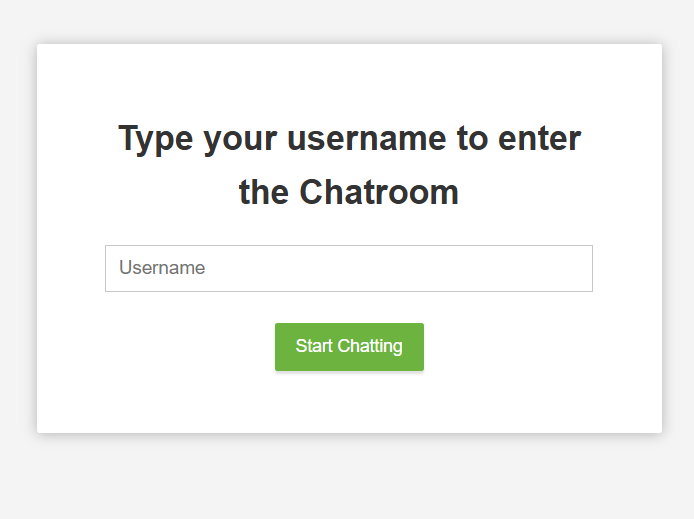
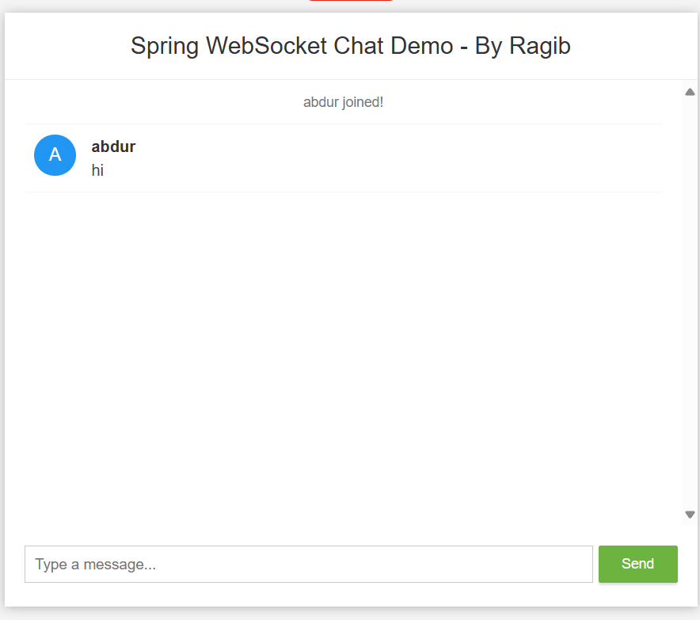

<div align="center">

# Spring Boot WebSocket Chat Application

[](https://opensource.org/licenses/MIT)
[](https://www.oracle.com/java/technologies/downloads/#java17)
[](https://spring.io/projects/spring-boot)
[](http://makeapullrequest.com)

A modern, real-time chat application built with Spring Boot and WebSocket technology. This application enables seamless communication between users in a clean, intuitive interface.


[Live Demo](#) · [Report Bug](../../issues) · [Request Feature](../../issues)

</div>

## 📝 Table of Contents
- [About](#about)
- [Features](#features)
- [Demo](#demo)
- [Technologies](#technologies)
- [Getting Started](#getting-started)
- [Usage](#usage)
- [Project Structure](#project-structure)
- [Contributing](#contributing)
- [Support](#support)
- [License](#license)

## 🚀 About
This chat application demonstrates the power of WebSocket technology in creating real-time, bidirectional communication channels. Perfect for both learning purposes and real-world applications.


## ✨ Features

- **Real-time Communication**: Instant message delivery using STOMP over WebSocket
- **User Presence**: Automatic join/leave notifications for users
- **Responsive Design**: Clean and modern UI that works on both desktop and mobile
- **Easy Access**: Simple username-based chat room entry
- **Message History**: View message history in the chat room
- **Typing Indicators**: See when other users are typing
- **Emoji Support**: Express yourself with emoji support
- **No Registration**: Start chatting instantly, no account required

## 🎮 Demo

Here's what the application looks like in action:

### Home Screen


### Chat Interface


## 🛠 Technologies

- **Backend:**
  - Spring Boot 3.3.8
  - Spring WebSocket
  - Java 17
  - Maven

- **Frontend:**
  - HTML/CSS
  - JavaScript
  - SockJS
  - STOMP.js

## 🏁 Getting Started

### Prerequisites

- Java 17 or higher
- Maven 3.x
- Your favorite IDE (We recommend IntelliJ IDEA or VS Code)

## Installation

1. Clone the repository
```bash
git clone [your-repo-url]
cd web-chat
```

2. Build the project
```bash
./mvnw clean install
```

3. Run the application
```bash
./mvnw spring-boot:run
```

The application will start at `http://localhost:8080`

## Usage

1. Open your browser and navigate to `http://localhost:8080`
2. Enter your username to join the chat room
3. Start chatting with other users in real-time

## Project Structure

```
src/main/
├── java/com/ragib/chat/
│   ├── chat/
│   │   ├── ChatController.java    # WebSocket message handlers
│   │   ├── ChatMessage.java       # Message model
│   │   └── MessageType.java       # Message type enums
│   └── config/
│       ├── WebSocketConfig.java     # WebSocket configuration
│       └── WebSocketEventListener.java # WebSocket event handlers
└── resources/
    └── static/
        ├── css/
        │   └── main.css          # Application styles
        ├── js/
        │   └── main.js          # Frontend JavaScript
        └── index.html          # Main application page
```

## 👥 Contributing

Contributions are what make the open source community such an amazing place to learn, inspire, and create. Any contributions you make are **greatly appreciated**.

1. Fork the Project
2. Create your Feature Branch (`git checkout -b feature/AmazingFeature`)
3. Commit your Changes (`git commit -m 'Add some AmazingFeature'`)
4. Push to the Branch (`git push origin feature/AmazingFeature`)
5. Open a Pull Request

## 💬 Support

For support, please reach out to us through:
- [Issue Tracker](../../issues)
- [Discussion Forum](../../discussions)
- Star this repository if you found it helpful!

<a href="https://github.com/ragibmondal/web-chat/stargazers">
    
</a>

## License

MIT License

Copyright (c) 2025 Ragib

Permission is hereby granted, free of charge, to any person obtaining a copy
of this software and associated documentation files (the "Software"), to deal
in the Software without restriction, including without limitation the rights
to use, copy, modify, merge, publish, distribute, sublicense, and/or sell
copies of the Software, and to permit persons to whom the Software is
furnished to do so, subject to the following conditions:

The above copyright notice and this permission notice shall be included in all
copies or substantial portions of the Software.

THE SOFTWARE IS PROVIDED "AS IS", WITHOUT WARRANTY OF ANY KIND, EXPRESS OR
IMPLIED, INCLUDING BUT NOT LIMITED TO THE WARRANTIES OF MERCHANTABILITY,
FITNESS FOR A PARTICULAR PURPOSE AND NONINFRINGEMENT. IN NO EVENT SHALL THE
AUTHORS OR COPYRIGHT HOLDERS BE LIABLE FOR ANY CLAIM, DAMAGES OR OTHER
LIABILITY, WHETHER IN AN ACTION OF CONTRACT, TORT OR OTHERWISE, ARISING FROM,
OUT OF OR IN CONNECTION WITH THE SOFTWARE OR THE USE OR OTHER DEALINGS IN THE
SOFTWARE.
